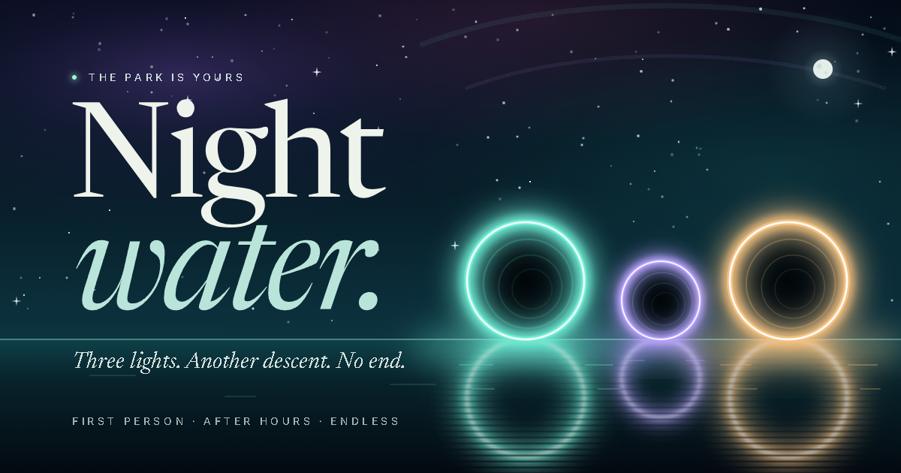
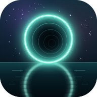

[](https://math.oddessentials.ai)

<p align="center">
  <a href="https://math.oddessentials.ai"><strong>Play in your browser</strong></a>
  &nbsp;·&nbsp;
  <a href="https://www.youtube.com/watch?v=BO8saAp3D2Y">Watch the trailer</a>
  &nbsp;·&nbsp;
  <a href="https://www.youtube.com/shorts/tHEKhC_5-Lk">Watch the short</a>
</p>

**Nightwater** is a first-person math game set in a water park after dark. Each pool asks a question, and its three exit pipes are the answers: choose one and ride it down to the next pool. The 210 levels run from single-digit addition to calculus, and the descent never ends. It plays in the browser on desktop and mobile. Headphones recommended.

<p align="center">
  <a href="https://www.youtube.com/watch?v=BO8saAp3D2Y"></a>
  &nbsp;
  <a href="https://www.youtube.com/shorts/tHEKhC_5-Lk"></a>
</p>

## How to play

1. **Ride.** Lean into the tube wall to catch lights. Your best catch multiplies the points for your next answer: an ember is ×2, a lantern ×5, and the one star on each ride ×10.
2. **Land.** The pool shows a question on its board and an answer over each exit.
3. **Answer.** Choose an exit, paddle to it, or let the current carry you.

A correct answer earns 100 points × the level number × your multiplier, plus up to half as much again for answering quickly. A wrong answer costs 75% of that stake, never taking your score below zero, and brings a fresh question at the same level. Progress saves in your browser.

| Action           | Keyboard and mouse                  | Touch              |
| ---------------- | ----------------------------------- | ------------------ |
| Lean in the tube | A / D or ← / →                      | Drag the thumb pad |
| Paddle in a pool | W A S D                             | Drag the thumb pad |
| Look around      | Drag, or click to capture the mouse | Drag               |
| Choose an exit   | 1 / 2 / 3, or click an answer       | Tap an answer      |
| Pause and sound  | Esc and M                           | On-screen buttons  |

The pause menu sets the ride speed (Relaxed, Fast, or Rush) and the rendering quality.

<details>
<summary><strong>The 21 stages</strong></summary>

Each stage has 10 levels. Every level generates fresh questions from its own rules, each with three choices and one correct answer.

1. Addition and Subtraction
2. Multiplication and Division
3. Number Patterns and Missing Numbers
4. Place Value, Rounding, and Estimation
5. Factors, Multiples, and Prime Numbers
6. Fractions
7. Decimals and Percentages
8. Measurement, Time, and Money
9. Ratios, Rates, and Proportions
10. Negative Numbers and Order of Operations
11. Exponents and Roots
12. Pre-Algebra: Expressions and Simple Equations
13. Algebra: Equations, Inequalities, and Systems
14. Geometry: Shapes, Angles, Perimeter, Area, and Volume
15. Coordinate Geometry and Graphing
16. Probability and Statistics
17. Advanced Algebra: Polynomials and Quadratics
18. Functions, Exponentials, and Logarithms
19. Trigonometry
20. Precalculus: Advanced Functions, Sequences, and Series
21. Calculus: Limits, Derivatives, and Integrals

</details>

## Development

Built with TypeScript, three.js, and Vite. Requires Node.js 22.12 or later; CI uses the version in `.node-version`.

```sh
npm ci        # installs dependencies and the Git hooks
npm run dev   # serves the game at http://127.0.0.1:4173
```

On Windows, `Launch Nightwater.cmd` does both and opens the browser.

Local runs look for the album at `127.0.0.1:4180` and play without it. To hear the live album instead, open:

```text
http://127.0.0.1:4173/?music=https://audio.oddessentials.ai/nightwater
```

With Cloudflare access and Docker, `npm run music:pull` and `npm run music:serve` serve a local copy.

Dev builds also accept `?stage=14&level=5` to start anywhere, and `?question=<id>` to replay a question by the id shown in the pause menu. Neither touches your saved progress.

| Command               | Purpose                                                           |
| --------------------- | ----------------------------------------------------------------- |
| `npm test`            | Unit tests for the ride, scoring, saves, and every question level |
| `npm run verify:full` | Everything the pre-push hook runs, including the browser checks   |
| `npm run build`       | Production build in `dist/`                                       |
| `npm run art`         | Re-render the icons and social card from `art/`                   |

[CONTRIBUTING.md](CONTRIBUTING.md) covers every check and the CI rules.

## Project layout

| Path             | Contents                                                        |
| ---------------- | --------------------------------------------------------------- |
| `src/`           | The game: ride physics, rendering, interface, and audio         |
| `src/questions/` | One question generator per stage                                |
| `tests/`         | Unit tests and the curriculum's worked examples                 |
| `scripts/`       | Checks, the art and music pipelines, and the launcher           |
| `art/`           | Brand art masters, documented in [art/README.md](art/README.md) |
| `music/`         | Album track list and encoding pipeline                          |
| `public/`        | Icons, social card, and math fonts                              |

## Deployment

GitHub Actions checks every pull request and every push to `main`, then deploys the build to Cloudflare Pages. Pull requests from this repository get a preview deployment, and `main` publishes to [math.oddessentials.ai](https://math.oddessentials.ai). The album is served from Cloudflare R2.

## Brand art



The app icon, logotype, and social card are vector masters in [`art/`](art). `npm run art` renders every favicon, launcher icon, and share image from them, and [art/README.md](art/README.md) documents the design system and each output.
